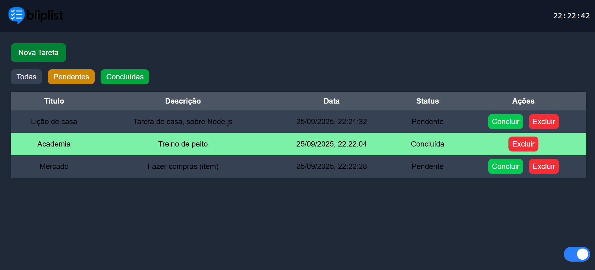
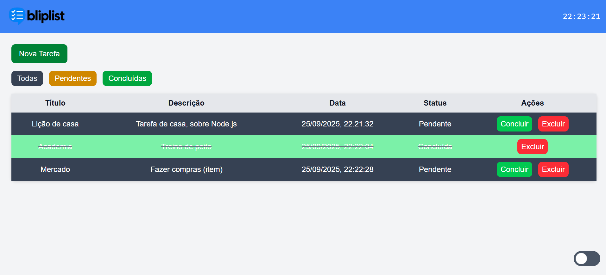

# 📌 Bliplist – To-Do List

## 📸 Preview

<p align="center">
  <b>🌙 Modo Dark</b><br>
  
</p>

<p align="center">
  <b>☀️ Modo Light</b><br>
  
</p>

---

## 📖 Descrição do Projeto

O **Bliplist** é uma aplicação de **To-Do List** desenvolvida como atividade da **SoulCode**, com o objetivo de permitir que o usuário organize suas tarefas do dia a dia de forma simples e intuitiva.

A aplicação foi construída utilizando **Vite (Vanilla JavaScript)** e **Tailwind CSS**, garantindo performance, responsividade e uma interface moderna.

O sistema possibilita **criar, listar, concluir, excluir e filtrar tarefas**, além de manter todos os dados salvos no **LocalStorage** para que não sejam perdidos ao recarregar a página.  
Também conta com um **relógio digital em tempo real** e suporte a **tema claro e escuro**.

---

## 🛠️ Stacks Utilizadas

- ⚡ **Vite (Vanilla JavaScript)** – Ambiente de desenvolvimento rápido e leve
- 🎨 **Tailwind CSS** – Estilização e suporte ao tema Dark/Light
- 📜 **JavaScript** – Lógica da aplicação e manipulação do DOM

---

## ✅ Funcionalidades

### 📌 Adicionar Nova Tarefa

- Botão **"Nova Tarefa"** abre um modal de cadastro.
- Campos obrigatórios: **Título** e **Descrição**.
- A **data de criação** é gerada automaticamente no momento do cadastro.
- O **status inicial** da tarefa é configurado como **"Pendente"**.
- Após salvar, a tarefa é registrada no **LocalStorage** em formato **JSON**.
- O modal é fechado automaticamente após o cadastro.

---

### 📋 Listar Tarefas

As tarefas são exibidas em uma **tabela** com as colunas:

- **Título**
- **Descrição**
- **Data de Criação** (dd/mm/yyyy hh:mm)
- **Situação** (Pendente ou Concluída)
- **Ações** (Concluir / Excluir)

🔴 **Excluir**

- Ao clicar, aparece um modal de confirmação:
  > "Deseja realmente excluir esta tarefa?"
- Se confirmado, a tarefa é removida do **LocalStorage**.

🟢 **Concluir**

- Ao clicar, aparece um modal de confirmação similar.
- Se confirmado, o status da tarefa muda para **"Concluída"**.

A tabela é **atualizada automaticamente** após cada operação.

---

### 🔍 Filtro por Status

- Exibição de tarefas por:
  - **Todas**
  - **Pendentes**
  - **Concluídas**

---

### 💾 Persistência no LocalStorage

- Todas as tarefas são salvas em formato **JSON** no LocalStorage.
- Ao recarregar a página, as tarefas continuam registradas.

---

### ⏰ Relógio Digital em Tempo Real

- Localizado no canto superior direito.
- Exibe a hora no formato **HH:mm:ss**.
- Atualiza automaticamente a cada segundo.

---

### 🌙☀️ Tema Claro/Escuro (Desafio Extra)

- Alternância entre **Dark Mode** e **Light Mode** com Tailwind CSS.
- Preferência do usuário é salva no **LocalStorage**.
- Interface se adapta dinamicamente ao tema escolhido.

---

## 🚀 Como Executar o Projeto

```bash
# Clonar o repositório
git clone <url-do-repositorio>

# Entrar na pasta do projeto
cd bliplist

# Instalar dependências
npm install

# Rodar o projeto
npm run dev
```
